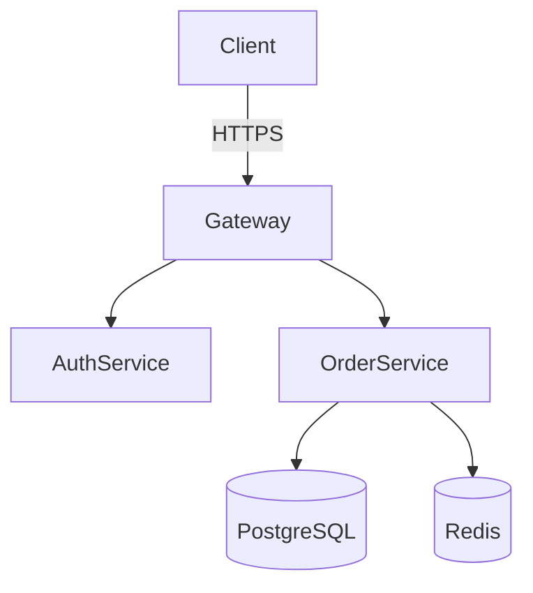
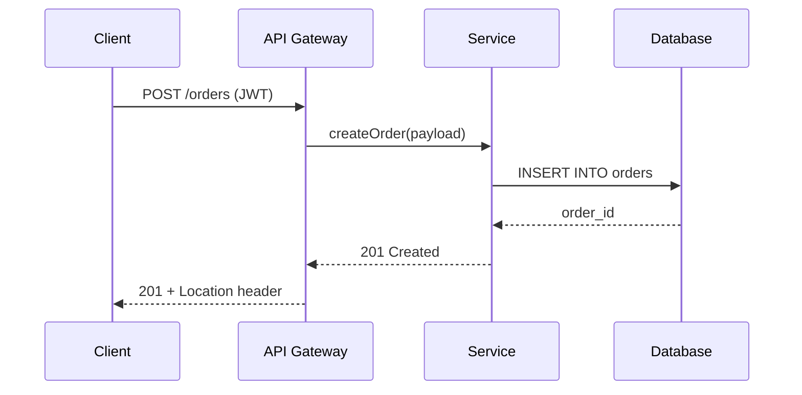
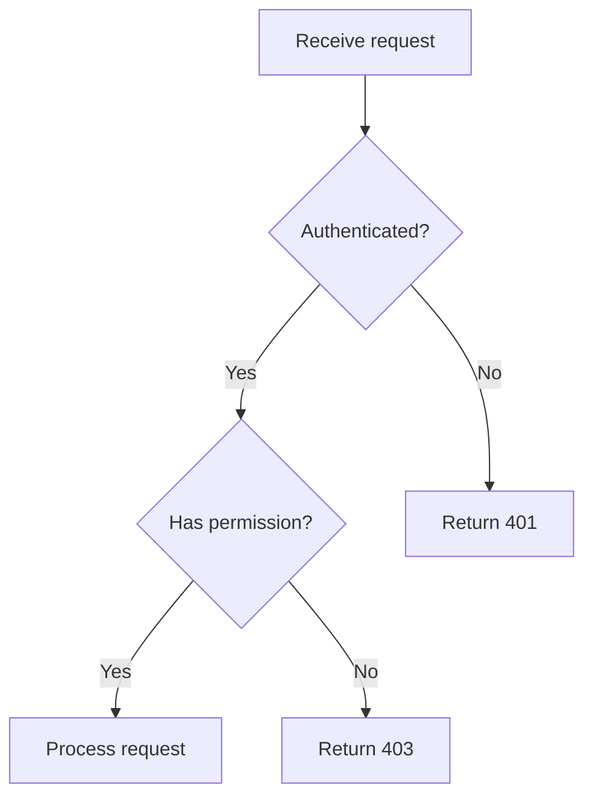
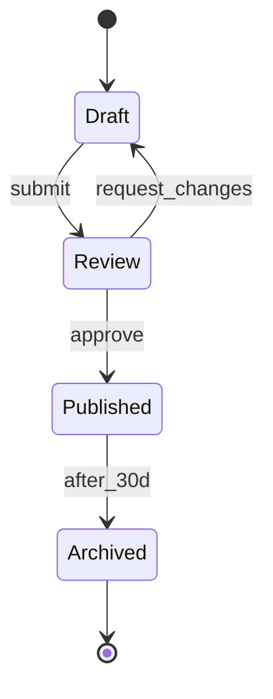
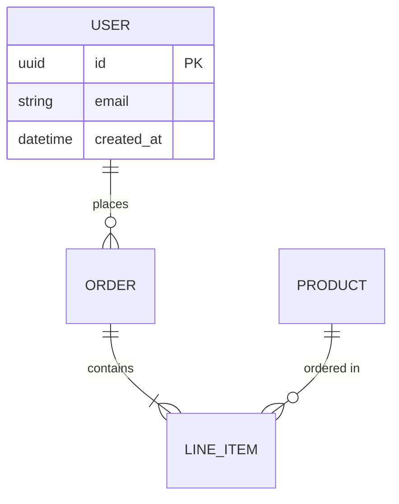

# Docsmith

Craft project documentation that reads like a human engineer wrote it. No AI slop. No hallucinated claims. Strong structure with diagrams and tables. Works for any website or app project regardless of tech stack.

## Reference Files

- For banned vocabulary, structural AI tells, hallucination patterns, and red-team scoring rubric, read [banned-patterns.md](banned-patterns.md)
- For document type templates with required sections and visual element positions, read [document-templates.md](document-templates.md)

<IRON-LAWS>

These rules are absolute. No exceptions. No "but this case is different."

**LAW 1 — EVIDENCE BEFORE CLAIMS.** Every technical claim must originate from verifiable source: actual code, official docs, or user-provided spec. Never fabricate API names, parameter types, config keys, library versions, benchmark numbers, or URLs. If unverifiable, mark `[UNVERIFIED — needs source]` or remove.

**LAW 2 — HUMAN VOICE ONLY.** Active voice with a human subject. Address the reader as "you." Vary sentence length deliberately — mix 5-word punches with 30-word explanations. No metronomic rhythm. No filler openers. No promotional adjectives.

**LAW 3 — VISUAL FIRST.** Every 2-3 content sections must include at least one visual element: Mermaid diagram, comparison table, flowchart, or architecture graph. Text is the last resort when a picture truly can't convey it.

**LAW 4 — VERIFY OR REMOVE.** If you cannot prove a technical fact, mark it `[UNVERIFIED]` or cut it. This covers API names, version numbers, config keys, performance numbers, third-party behavior, and URLs.

</IRON-LAWS>

## Core Writing Principles

1. **Lead with the point.** First sentence of every section states what the reader will learn or do. No throat-clearing.

2. **One idea per sentence. One topic per paragraph.** 2-4 sentences per paragraph max.

3. **Concrete over abstract.** "The login endpoint accepts POST with JSON body containing `email` and `password`" beats "The authentication module handles user credentials."

4. **Delete filler ruthlessly.** "Use" > "utilize." "Start" > "commence." "Show" > "demonstrate."

5. **Tech-stack agnostic.** Describe the role, not the tool. Only name specific tech when the document explicitly requires it.

6. **Write for scanning.** Put the answer first, context second. Headings state conclusions ("Auth tokens expire after 24h" not "About Token Expiration").

## Document Router

Match the user's request to a document type. Read [document-templates.md](document-templates.md) for the structural spec of each type.

```
User needs to document...
│
├─ WHAT to build and why
│  ├─ Features + acceptance criteria → product-requirements
│  ├─ Business goals + scope → project-brief
│  └─ Specific capability → feature-spec
│
├─ HOW it works architecturally
│  ├─ System overview + component diagram → architecture-doc
│  ├─ Why we chose X over Y → adr
│  ├─ Endpoint contracts → api-spec
│  └─ Schema + relationships → database-design
│
├─ HOW to build / use
│  ├─ Project overview + setup → readme
│  ├─ Team conventions → coding-standards
│  ├─ Step-by-step learning → tutorial
│  └─ How to do a specific thing → howto-guide
│
├─ HOW to ship / operate
│  ├─ Deploy steps + rollback → deployment-guide
│  ├─ What changed → changelog
│  ├─ Testing strategy → test-plan
│  └─ Runbook + monitoring → ops-manual
│
├─ HOW to use (end user)
│  ├─ First steps in 5 min → quickstart
│  ├─ Complete reference → user-guide
│  └─ Common problems → faq
│
└─ REFLECTION
   ├─ What happened + lessons → postmortem
   └─ Knowledge transfer → handover
```

If the user's description doesn't map cleanly, ask one question to clarify. Don't guess.

## Writing Workflow

### Step 1 — IDENTIFY

Determine document type from the router. Identify audience, scope, and evidence sources (code, configs, existing docs, user-provided specs).

### Step 2 — OUTLINE

Read [document-templates.md](document-templates.md). Find the matching template. Build the skeleton with its required sections. Mark visual element positions:
- `[TABLE: ...]` — what data the table compares
- `[DIAGRAM: mermaid type — ...]` — what the diagram illustrates
- `[CALLOUT: note|warning|tip — ...]` — critical information

### Step 3 — DRAFT

Write section by section. Follow the core writing principles. Before drafting, read [banned-patterns.md](banned-patterns.md) for the banned vocabulary and structural tells. Key rules:

- No banned opener in the first sentence of any section
- Vary sentence length: after 2-3 long sentences, drop a short one
- Every code block shows expected output or result
- No "In this document/article/section..." meta-commentary

### Step 4 — VISUALIZE

Insert diagrams and tables at marked positions. Never use ASCII art diagrams (box-drawing characters like `┌──┐`) — use Mermaid instead. Directory trees are the only exception.

#### Diagram Selection Decision Tree

```
What are you showing?
│
├─ Parts of a system and how they connect
│  ├─ High-level overview (3-10 components) → graph TD or graph LR
│  └─ Detailed with protocols/data formats → graph TD with edge labels
│
├─ A process with time ordering
│  ├─ Actors exchanging messages → sequenceDiagram
│  ├─ Single actor with branching decisions → flowchart
│  └─ Parallel processes → sequenceDiagram with par blocks
│
├─ Entity relationships and data model
│  ├─ Database schema → erDiagram
│  └─ Code structure (classes, interfaces) → classDiagram
│
├─ State changes over time
│  ├─ Entity lifecycle (draft → review → published) → stateDiagram-v2
│  └─ Project timeline → gantt
│
├─ Comparing options or attributes
│  ├─ 2+ dimensions (rows × columns) → Markdown table
│  └─ Pros/cons for 2 options → Prose paragraph (not a table)
│
├─ Decision logic or branching rules
│  └─ flowchart (diamond nodes for decisions)
│
└─ Critical warning, tip, or note
   └─ Callout box (> **Warning:** text)
```

#### Diagram Type Reference

**Architecture / Component Diagram** — `mermaid graph TD` or `graph LR`
Use when: showing system components and their connections.



Tip: Use `TD` (top-down) for layered architectures, `LR` (left-right) for pipelines or sequential flows. Add edge labels (`-->|label|`) to show protocols or data formats.

**Sequence Diagram** — `mermaid sequenceDiagram`
Use when: showing message exchange between actors over time. Request/response flows, API call chains, event-driven interactions.



Tip: Use `->>` for synchronous calls, `--)` for async events, `-->>` for responses. Group related messages with `rect rgb(200,220,255)` blocks.

**Flowchart** — `mermaid flowchart`
Use when: showing decision trees, branching workflows, conditional logic. NOT for architecture overviews (use graph instead).



Tip: Use diamond `{}` for decisions, rounded `()` for processes, `([])` for terminal states. Keep each flowchart under 15 nodes — split into sub-diagrams if larger.

**State Diagram** — `mermaid stateDiagram-v2`
Use when: showing entity lifecycle or status transitions. Order states, task statuses, document approval flows.



**ER Diagram** — `mermaid erDiagram`
Use when: showing database schema, entity relationships, cardinality.



**Class Diagram** — `mermaid classDiagram`
Use when: showing code structure — modules, classes, interfaces, inheritance. NOT for runtime architecture (use graph instead).

**Gantt Chart** — `mermaid gantt`
Use when: showing project timelines, sprint schedules, deployment windows. NOT for state transitions (use stateDiagram instead).

#### Table vs Diagram Decision

| Situation | Use Table | Use Diagram |
|---|---|---|
| Comparing 3+ options on 3+ attributes | Yes | No |
| Listing config parameters | Yes | No |
| Showing how components connect | No | Yes |
| Showing a time-ordered process | No | Yes |
| Showing entity relationships | No (unless <4 entities, 1-2 attrs) | Yes |
| Showing decision branching logic | No | Yes |
| Parameter reference (name, type, default) | Yes | No |

#### Callout Boxes

Use for critical information that MUST NOT be missed. Not for every paragraph.

```markdown
> **Warning:** Deleting this table is irreversible. Run a backup first.

> **Tip:** You can skip this step if you're using the default configuration.

> **Note:** This endpoint is rate-limited to 100 requests per minute.
```

Rules: max 2 callouts per section. If you need more, the section needs restructuring.

### Step 5 — RED-TEAM VERIFY

MANDATORY. Skipping is a violation.

1. **Pattern Scan.** Read [banned-patterns.md](banned-patterns.md). Scan the document for every banned pattern. Fix or rewrite flagged content.
2. **Hallucination Check.** For every technical claim: can you point to the source? If no → mark `[UNVERIFIED]` or remove.
3. **Rhythm Check.** Flag 3+ consecutive similar-length sentences, 3+ paragraphs starting the same way, any sentence that sounds like a motivational poster.
4. **Completeness.** Check against the template in [document-templates.md](document-templates.md). All required sections present? All visuals inserted?

## Red Flags — STOP and Verify

These thoughts mean you're about to produce AI slop:

| Thought | Reality |
|---|---|
| "This draft looks clean enough" | Run [banned-patterns.md](banned-patterns.md) scan. "Looks clean" is how slop ships |
| "The reader won't notice" | They will. AI patterns are instantly recognizable |
| "I'll verify technical details later" | Later never comes. Verify now or mark UNVERIFIED |
| "This sentence sounds professional" | "Professional" is often a mask for "corporate buzzword" |
| "Let me add a summary paragraph" | Documents don't need summaries. Each section states its point |
| "This needs more detail to be thorough" | More words ≠ more thorough. More specifics does |
| "The user didn't specify tech stack, I'll pick one" | Tech-agnostic by default. Name tech only when required |

## Language-Specific Rules

### English

- Contractions OK: it's, you'll, we're, don't
- Sentence case for headings: "Getting started" not "Getting Started"
- Oxford comma. One space after periods. Target 10-25 words per sentence.

### Chinese (中文)

- 短句优先：一句话一个意思，平均15-25字
- 禁止翻译腔："关于...的问题" → 直接说问题
- 用具体名词代替笼统词："处理" → 校验/存储/转发
- 主动语态。避免"的"字堆叠。技术术语保留英文原文。
- **避免列表式写作。** 不要用序号编号、项目符号、分层缩进来组织段落——那是AI写作的典型特征。改用自然段落过渡；用Mermaid图表替代多级列表的信息层级——图表永远比列表更有说服力。段落之间用空行分隔，段落内部用"——"或破折号连接上下文。

## Quality Metrics

| Metric | Target |
|---|---|
| Average sentence length | 10-25 words (EN) / 15-25 chars (ZH) |
| Max consecutive similar-length sentences | 2 |
| Paragraph length | 2-4 sentences |
| Visual elements per major section | ≥ 1 |
| Code blocks with expected output | 100% |
| Banned pattern hits | 0 |
| UNVERIFIED claims | Flagged with source suggestion |
| Headings state conclusions (not topics) | ≥ 80% |

## Final Checklist

- [ ] [banned-patterns.md](banned-patterns.md) scanned — zero banned patterns remain
- [ ] Sentence rhythm varies — no 3+ consecutive similar-length sentences
- [ ] All technical claims verified or marked [UNVERIFIED]
- [ ] All diagrams/tables present and referenced in text
- [ ] No throat-clearing openers in any section
- [ ] Headings state conclusions, not just topics
- [ ] Tech-stack agnostic
- [ ] Document matches template from [document-templates.md](document-templates.md)
- [ ] Every code block has expected output or result
- [ ] Passes the "read aloud" test — sounds like a human talking
