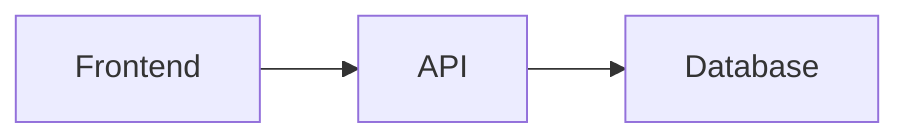

# Banned Patterns Reference

Scan every document against this list before delivery. Zero tolerance.

## English Banned Vocabulary

### Empty Openers — Delete on Sight

| Banned | Why It's Banned |
|---|---|
| "In today's fast-paced world..." | No document needs a worldview preamble |
| "In the realm of..." | Vague spatial metaphor. Say where, specifically |
| "It's worth noting that..." | If it's worth noting, just note it |
| "It's important to note that..." | Same. Just state the thing |
| "In this section, we will explore..." | Meta-commentary. Start with the content |
| "Let's dive into..." | "Dive" is AI's favorite verb. Just start |
| "Before we begin, let's understand..." | Hand-holding. The reader is an adult |
| "As we navigate the complexities of..." | Navigation metaphor + complexity hedging |
| "In the ever-evolving landscape of..." | Cliché + vague. What specifically changed? |
| "At the heart of..." | Overused metaphor. Say "The core is..." |
| "A testament to..." | Promotional. Remove |
| "In conclusion..." | If the document needs a summary, the structure is wrong |
| "To summarize what we've covered..." | Same. Sections should stand on their own |
| "As mentioned earlier..." | If you mentioned it, you don't need to mention it again |
| "Needless to say..." | Then don't say it |
| "It goes without saying that..." | Same |

### Adverbial Crutches — Replace with Specifics

| Banned Adverb | Replacement Strategy |
|---|---|
| significantly | Give the number: "improved latency by 40%" |
| profoundly | Delete. If something matters, explain why concretely |
| seamlessly | Describe the mechanism: "automatically redirects on auth failure" |
| effectively | Delete. Show the effect |
| remarkably | Delete. State the observation |
| fundamentally | Delete. State the fundamental fact |
| essentially | Delete. State the essence directly |
| basically | Delete. Just say it |
| arguably | Either argue it or don't claim it |
| arguably | Either argue it or don't claim it |

### Corporate Buzzwords — Use Plain Words

| Banned | Plain English |
|---|---|
| leverage | use |
| harness | use |
| utilize | use |
| facilitate | help / enable |
| streamline | simplify / speed up |
| empower | let / enable |
| robust | reliable / fault-tolerant |
| scalable | handles N concurrent users |
| cutting-edge | (delete — say what's new about it) |
| best-in-class | (delete — give the benchmark) |
| game-changer | (delete — describe the actual impact) |
| paradigm shift | (delete — describe what changed) |
| synergy | (delete — say how things work together) |
| holistic | complete / end-to-end |
| intuitive | (delete — describe the UX) |
| elegant | (delete — describe what makes it clean) |
| innovative | (delete — describe the innovation) |
| next-generation | (delete — say what version/generation) |
| world-class | (delete — name the benchmark) |
| mission-critical | required / must-have |

### Grandiose Adjectives — Delete or Prove

| Banned | Why |
|---|---|
| transformative | Prove it transformed something, or delete |
| groundbreaking | Name what ground was broken |
| pivotal | Name the decision point |
| vibrant | (for communities/ecosystems — delete) |
| breathtaking | (delete — this is a tech doc, not a travel brochure) |
| renowned | Name the source of renown |
| unparalleled | (delete — you haven't checked all alternatives) |
| unprecedented | (delete — same reason) |
| revolutionary | (delete — describe the change) |
| remarkable | (delete — state the observation) |

### Cliché Metaphors — Ban Entirely

| Banned | Just Say It |
|---|---|
| "a tapestry of..." | "X includes A, B, and C" |
| "a symphony of..." | "X combines A, B, and C" |
| "a kaleidoscope of..." | "X offers many varieties: A, B, C" |
| "navigate the landscape" | "use / explore / work with" |
| "push the boundaries" | "extend / improve" |
| "raise the bar" | "improve [specific metric]" |
| "set a new standard" | (delete — let readers judge) |
| "the gold standard" | (delete — name the benchmark) |
| "a double-edged sword" | "trade-off: X gains Y but loses Z" |
| "the best of both worlds" | (delete — describe the combination) |

### Lazy Framing Patterns

| Pattern | Example | Fix |
|---|---|---|
| "Think of X as Y" | "Think of Docker as a shipping container" | "Docker isolates each app in a container" |
| "X is like Y" | "An API is like a waiter" | "An API accepts requests and returns responses" |
| "About X" (as opener) | "About authentication:" | "Authentication uses JWT tokens with 24h expiry" |
| "Not X, but Y" | "Not a library, but a framework" | "It's a framework" |
| "More than X — it's Y" | "More than a tool — it's a paradigm" | Just describe what it does |
| "X meets Y" | "Where simplicity meets power" | (delete — meaningless) |

### Structural Tells

**Binary Contrast Formula**
Pattern: "Traditional approaches do X. Modern solutions, however, do Y."
Problem: Creates fake drama. Implies old = bad without evidence.
Fix: Just describe what the current approach does.

**Negative Listing**
Pattern: Defining things by what they are NOT rather than what they ARE.
Example: "This is not just a database wrapper. It's not merely an ORM."
Fix: State what it IS. "It provides connection pooling, query caching, and migration management."

**Metronomic Rhythm**
Pattern: All sentences are 15-20 words, same subject-verb-object structure.
Fix: Deliberately vary. After two long sentences, write a short one. Like this.

**Five-Paragraph Essay**
Pattern: Intro → Body 1 → Body 2 → Body 3 → Conclusion
Problem: Technical docs aren't high school essays. No intro/conclusion needed.
Fix: Each section is self-contained. Lead with the point. No wrap-up.

**Pseudo-Profound Closers**
Pattern: "This is more than a feature — it's a philosophy."
Fix: Just end the document. The last section doesn't need a bow.

**Dangling Participle Tail**
Pattern: "...providing a seamless experience." / "...ensuring optimal performance."
Fix: Make it a new sentence with a subject. "This reduces latency by 40%."

**Wh-Word Openers**
Pattern: Every section starts with "What is X?" or "How does X work?"
Fix: Start with the answer. "X is a caching layer that stores..."

**Over-Listification**
Pattern: Everything in bullet points. No narrative prose. AI defaults to lists for almost all content — explanations, comparisons, steps, even conceptual overviews get turned into bullets.
Problem: Lists fragment ideas into disconnected fragments. They strip context, causality, and nuance. Complex concepts need connected reasoning to explain WHY and HOW things relate.
Fix: See the detailed decision guide below.

### List vs Prose vs Table — Decision Guide

The core question: what is the information structure? Use this table to decide:

| Information Structure | Format | Why | Example |
|---|---|---|---|
| Sequential steps (do A, then B, then C) | Numbered list | Order matters, each step is atomic | "1. Clone repo 2. Install deps 3. Start server" |
| Parallel options (pick one of N) | Bulleted list | Items are independent choices | "You can deploy via Docker, VM, or serverless" |
| Comparing attributes across options | Table | Cross-referencing is the core task | Comparing 3 database options across 5 criteria |
| Explaining WHY something works or was chosen | Prose paragraph | Causality needs connected reasoning | "We chose Redis because the read pattern is..." |
| Explaining HOW a complex system behaves | Prose paragraph | Interaction between parts needs narrative | "When a user submits a form, the client validates..." |
| Defining terms or mapping concepts | Definition list or table | Key-value pairs | "API: the contract between frontend and backend" |
| Enumerating constraints or requirements | Bulleted list | Each item is a standalone constraint | "Must support HTTPS, rate limiting, and CORS" |
| Describing a decision with trade-offs | Prose paragraph | Trade-off analysis is inherently narrative | "Option A gives speed but loses observability..." |
| Showing before/after or bad/good | Side-by-side code block | Visual comparison is more effective than listing | Code diff or two code blocks labeled "Before" and "After" |
| Status or progress tracking | Table | Need multiple dimensions per item | Tasks with owner, status, deadline columns |

**Rules for when to use lists:**
- Bulleted list: 3-7 items, each item is a standalone fact, no cross-item dependency
- Numbered list: strict sequential order, each step depends on the previous
- If your list has 10+ items, it probably needs to be a table or reorganized into sections

**Rules for when to use prose:**
- You're explaining causality ("because X, therefore Y")
- You're comparing trade-offs that need context
- You're telling the story of a system's behavior
- The reader needs to understand HOW parts interact, not just WHAT parts exist

**Rules for when to use tables:**
- Two or more dimensions of data (rows × columns)
- The reader will cross-reference (looking at one option, comparing across attributes)
- Parameter lists, configuration options, comparison matrices

**AI's default failure mode:** AI converts everything to bullet lists because lists are statistically "safe" — they don't require paragraph-level reasoning. If you catch yourself writing a 5-item bullet list explaining WHY something works, stop. Write a paragraph instead.

### ASCII Art Diagrams — Banned

Pattern: Using box-drawing characters (`┌─────┐ │ ─ └ ┘`) or text-based art for architecture diagrams, flowcharts, or system layouts.

```
┌─────────┐     ┌─────────┐     ┌─────────┐
│ Frontend │────▶│   API   │────▶│Database │
└─────────┘     └─────────┘     └─────────┘
```

Problem:
- Not renderable — looks different in every font, editor, terminal width
- Not maintainable — moving a box means rewriting dozens of characters
- Not interactive — can't click, zoom, or navigate
- Not searchable — diagram content is invisible to text search
- Not accessible — screen readers can't interpret it
- Breaks in Markdown renderers — monospace blocks don't preserve alignment on narrow screens

Fix: Use Mermaid diagrams instead. The same architecture:



**The only acceptable use of ASCII diagrams:** showing raw terminal output or file structure trees where the monospace formatting is the content itself:

```
project/
├── src/
│   ├── components/
│   └── utils/
├── tests/
└── package.json
```

This is a directory tree, not a diagram. It's acceptable because the tree structure IS the data.

---

## Chinese Banned Vocabulary (中文禁用词)

### 空洞前缀 — 直接删除

| 禁用 | 处理方式 |
|---|---|
| "在当今...的时代" | 删除，直接说事实 |
| "随着...的发展" | 删除，直接说变化 |
| "关于...的问题" | 删除"关于"和"的问题"，直接说 |
| "值得注意的是" | 删除，直接陈述 |
| "不可否认" | 删除，直接说 |
| "众所周知" | 删除。如果真众所周知，不需要说 |
| "毋庸置疑" | 同上 |
| "让我们来看看" | 删除，直接开始 |
| "接下来我们将探讨" | 删除，直接开始 |
| "总而言之" | 删除，各段自包含 |
| "综上所述" | 同上 |
| "在此基础上" | 删除，直接说下一步 |

### 企业废话 — 用大白话说

| 禁用 | 大白话 |
|---|---|
| 赋能 | 让...能做 / 支持 |
| 端到端 | 从A到Z / 全流程 |
| 一站式 | 集成A、B、C功能 |
| 闭环 | 自动循环 / 完整流程 |
| 抓手 | 手段 / 方法 |
| 打法 | 策略 / 做法 |
| 落地 | 实现 / 部署 |
| 沉淀 | 积累 / 保存 |
| 对齐 | 统一 / 一致 |
| 拉通 | 打通 / 连接 |
| 颗粒度 | 详细程度 |
| 底层逻辑 | 基本原理 |
| 顶层设计 | 整体架构 |
| 方法论 | 方法 / 做法 |
| 维度 | 方面 / 角度 |
| 心智 | 认知 / 理解 |
| 生态 | 体系 / 环境 |
| 矩阵 | 组合 / 系列 |
| 链路 | 路径 / 流程 |

### 翻译腔 — 中文技术文档常见英文思维

| 翻译腔 | 自然中文 |
|---|---|
| "关于X的问题" | "X" |
| "对于Y来说" | "Y" |
| "就...而言" | 删除 |
| "在...方面" | 删除或改写 |
| "基于以上分析" | "由此" |
| "通过...的方式" | "用..." |
| "被用于" | "用来" |
| "被认为是" | "是" |
| "X的Y化" | "Y X" |
| "进行了X" | "X了" |

### "的"字堆叠修正

| 错误 | 修正 |
|---|---|
| "一个高效的稳定的安全的系统" | "一个高效、稳定、安全的系统" |
| "用户的个人的敏感的数据" | "用户个人敏感数据" |
| "新的基于云的解决方案" | "新的云端解决方案" |

---

## Hallucination Patterns

Common hallucination types and detection signals:

### Fabricated API / Function Names

Signal: You're generating a function name that "sounds right" but you haven't seen it in actual code or docs.
Example: `pandas.file_processor.advanced_transform()` — doesn't exist.
Tactic: Check the actual module/class definition. If you can't access it, mark [UNVERIFIED].

### Invented Configuration Keys

Signal: You're writing config that "should" exist based on convention.
Example: `app.config.max_retry_count` — might be `maxRetries` or `retryLimit` instead.
Tactic: Check actual config schema or .env.example file.

### Phantom Dependencies

Signal: You're suggesting a library or package that "sounds like it should exist."
Example: `npm install react-form-validator-pro` — might not exist.
Tactic: Check the actual package registry. If you can't, mark [UNVERIFIED].

### Fake Statistics

Signal: You're citing a percentage, number, or benchmark without a source.
Example: "90% of developers prefer..." — you made this up.
Tactic: Delete the statistic or cite a specific survey with URL and date.

### Ghost References

Signal: You're generating a URL, paper title, or book reference.
Example: `https://docs.example.com/api/v2/advanced-usage` — might 404.
Tactic: Only include URLs you've actually verified. Otherwise say "see official docs for [feature name]."

### Version Hallucination

Signal: You're stating a minimum version or compatibility claim.
Example: "Requires Node.js >= 18.0" — might be 16.0 or 20.0.
Tactic: Check package.json, setup.py, or equivalent manifest.

---

## Red-Team Scoring Rubric

After completing the document, score it on these 5 dimensions (1-7 each):

| Dimension | 1 (Worst) | 7 (Best) |
|---|---|---|
| **Directness** | Opens with filler, buries the point | First sentence of every section IS the point |
| **Rhythm** | All sentences same length, robotic | Natural variation, short punches after long explanations |
| **Trust** | Passive voice, abstract subjects | Active voice, human actors, "you" address |
| **Authenticity** | Generic, could be about anything | Specific details, real numbers, actual file paths |
| **Density** | Every sentence padded with filler | Every word carries information |

**Minimum passing score: 30/35.** Below 30 → rewrite flagged sections and re-score.

### Scoring Guide

**Directness:**
- 1-3: Has throat-clearing openers, summary paragraphs, or meta-commentary
- 4-5: Mostly direct, occasional filler
- 6-7: Every section opens with its core message, zero filler

**Rhythm:**
- 1-3: Metronomic — all sentences 15-20 words
- 4-5: Some variation, but patterns emerge
- 6-7: Deliberate mix of 5-word and 35-word sentences

**Trust:**
- 1-3: Passive voice dominant, "it was found that..."
- 4-5: Mix of active and passive
- 6-7: Active voice with human subjects throughout

**Authenticity:**
- 1-3: Generic descriptions, no specifics
- 4-5: Some specifics, some generic
- 6-7: File paths, line numbers, actual values, real examples

**Density:**
- 1-3: Padded with adverbs, qualifiers, and filler
- 4-5: Mostly dense, occasional padding
- 6-7: Every word earns its place
